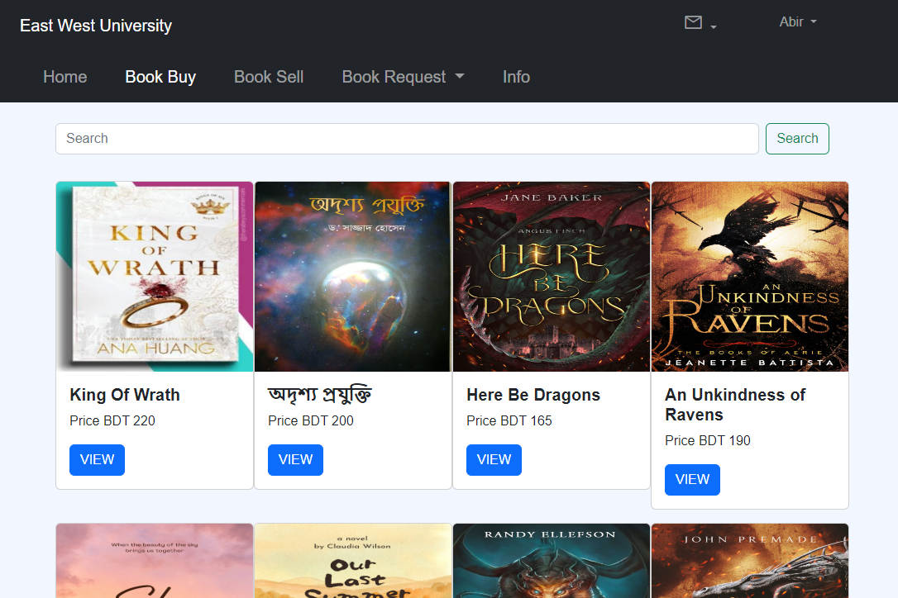
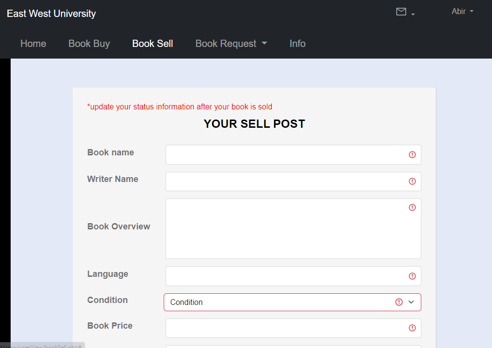
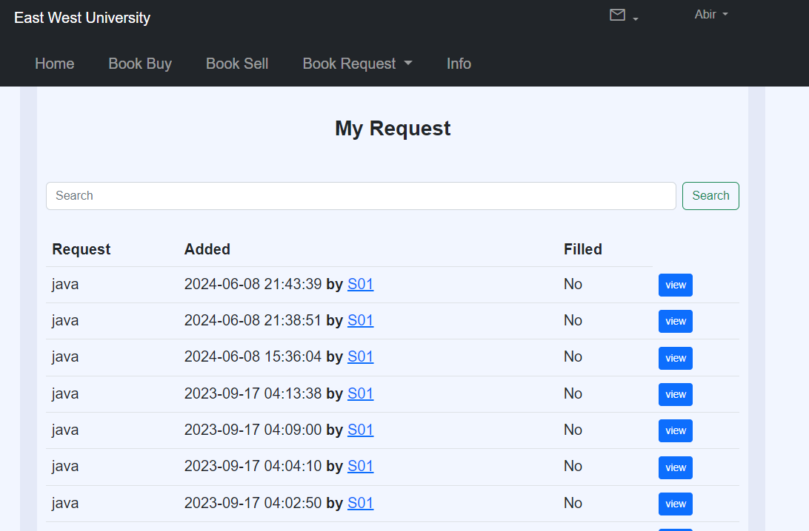
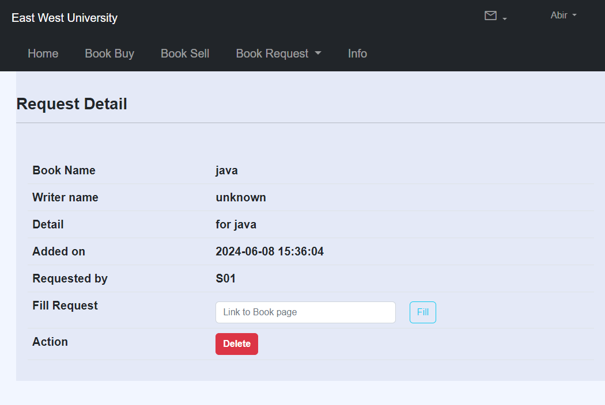
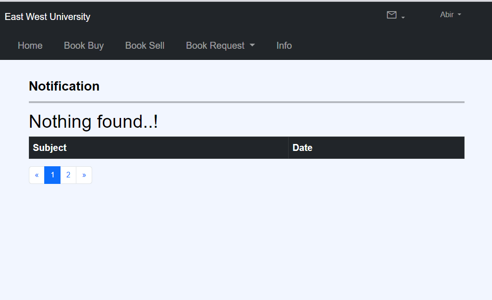

# East West University Book Buy and Sell Website

## About the Project
The East West University Book Buy and Sell Website is a dedicated platform for university students to buy and sell used books. This website provides a secure and user-friendly environment where students can register, verify their accounts, list their used books for sale, and manage their book-related activities.

## Features
- **User Registration**: Only university students can register to maintain community integrity.
- **Verification Code**: Upon registration, users receive a verification code via email to activate their accounts.
- **Book Listing**: Users can list their used books for sale, including details and images.
- **Book Search**: A search feature allows users to find available books quickly.
- **Request System**: Users can request books that are not currently listed, and other users can fulfill those requests.
- **Notification System**: Users receive notifications regarding their requests and updates on their listings.
- **Profile Management**: Users can view profiles, including their listed books.
- **Request Page**: Users can view and manage book requests from other users.

## Technologies Used
- **Frontend**: 
  - HTML
  - CSS
  - Bootstrap
  - JavaScript (for minor functionalities)
  
- **Backend**: 
  - PHP
  - MySQL (for database management)
  - PHPMailer (for sending emails)

## Installation

### Prerequisites
- XAMPP (with Apache and MySQL)
- A web browser

### Steps to Install

1. **Create a New Database**:
   - Open XAMPP and start the Apache and MySQL services.
   - Access phpMyAdmin by navigating to `http://localhost/phpmyadmin` in your web browser.
   - Create a new database named `ewu_book_buy_sell`.

2. **Import the SQL File**:
   - Click on the newly created database (`ewu_book_buy_sell`).
   - Go to the "Import" tab.
   - Choose the provided SQL file (`ewu_book_buy_sell.sql`) and click "Go" to import the database structure and initial data.


### Steps to Install

1. **Clone the Repository**:
   First, clone the repository to your local machine using the following command:
   ```bash
   git clone https://github.com/yourusername/east-west-university-book-buy-sell.git

### Screenshots






